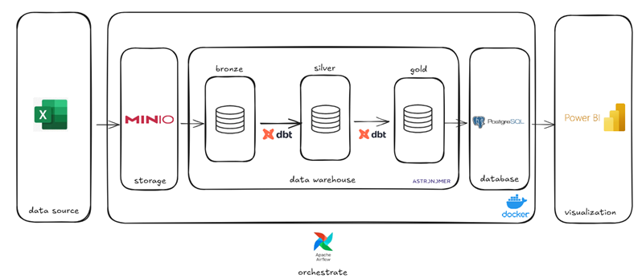
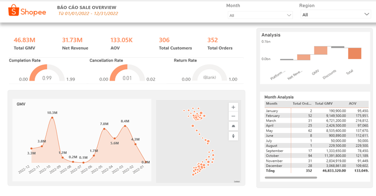
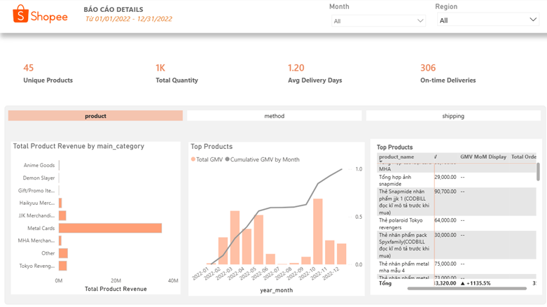

# Shopee E-Commerce Data Warehouse

An end-to-end data engineering project that builds an analytics-ready data warehouse from Shopee Vietnam seller data using the **Medallion Architecture** (Bronze → Silver → Gold), orchestrated with Apache Airflow and transformed with dbt.


---

## Table of Contents

- [Architecture](#architecture)
- [Project Structure](#project-structure)
- [Tech Stack](#tech-stack)
- [Data Model](#data-model)
- [Getting Started](#getting-started)
- [Power BI Dashboard](#power-bi-dashboard)
---

## Architecture



### Medallion Architecture

| Layer | Description | Materialization |
| :--- | :--- | :--- |
| **Bronze** | Raw data as-is from source for audit trail & reprocessing | View |
| **Silver** | Cleaned, typed, deduplicated, and standardized tables | Table |
| **Gold** | Analytics-ready Star Schema (Facts + Dimensions) | Table |


---
## Project Structure

```
de_ecommerce/
│
├── dags/                              
│   ├── full_load_dag.py               
│   └── incremental_load_dag.py        
│
├── dbt/
│   └── ecommerce_dbt/
│       ├── models/
│       │   ├── bronze/                
│       │   │   └── brz_raw_orders.sql
│       │   ├── silver/                
│       │   │   ├── slv_orders.sql
│       │   │   ├── slv_customers.sql
│       │   │   ├── slv_products.sql
│       │   │   └── slv_dates.sql
│       │   └── gold/                  
│       │       ├── facts/
│       │       │   └── fct_orders.sql
│       │       ├── dimensions/
│       │       │   ├── dim_customer.sql     
│       │       │   ├── dim_product.sql
│       │       │   ├── dim_date.sql
│       │       │   ├── dim_shipping.sql
│       │       │   └── dim_payment.sql
│       │       └── aggregates/
│       │           ├── agg_daily_sales.sql
│       │           ├── agg_product_performance.sql
│       │           └── agg_customer_summary.sql
│       ├── macros/
│       ├── tests/
│       └── dbt_project.yml
│
├── scripts/                          
│   ├── load_raw_orders.py             
│   ├── upload_to_minio.py             
│   
│
├── EDA/                               
│   ├── data_preparation.ipynb
│   └── merge_orders.ipynb
│
├── raw_data/                          
│   ├── data/                          
│   ├── orders_merged.csv
│   └── dim_*.csv                      
│
├── docker-compose.yaml                
├── Dockerfile                         
├── requirements.txt                   
└── packages.txt                       
```
---
## Tech Stack

| Component         | Technology                          | Purpose                              |
|-------------------|-------------------------------------|--------------------------------------|
| **Orchestration** | Apache Airflow (Astro Runtime 12.10)| Pipeline scheduling & monitoring     |
| **Transformation**| dbt-core 1.8 + dbt-postgres 1.8    | SQL-based data transformation (ELT)  |
| **Database**      | PostgreSQL 14                       | Data warehouse storage               |
| **Object Storage**| MinIO                               | S3-compatible raw file storage       |
| **Visualization** | Power BI                            | Business intelligence dashboards     |
| **Infrastructure**| Docker & Docker Compose             | Containerized deployment             |
| **Language**       | Python 3, SQL                      | Scripting & transformations          |

### Key Libraries

```
astronomer-cosmos    dbt-core       dbt-postgres    pandas
pyarrow              boto3          minio           openpyxl
psycopg2-binary      sqlalchemy
```

---

## Data Model


### Key Metrics

| Metric              | Formula                                                        |
|---------------------|----------------------------------------------------------------|
| **GMV**             | `SUMX(VALUES(order_id), MAX(order_total_vnd))`                 |
| **Net Revenue**     | `total_paid - fixed_fee - service_fee - payment_fee`           |
| **AOV**             | `GMV / Total Orders`                                           |
| **Completion Rate** | `Completed Orders / Total Orders`                              |
| **RFM Segmentation**| Recency × Frequency × Monetary scoring (ntile 1-5)            |

---

---

## Getting Started

### Prerequisites

- [Docker Desktop](https://www.docker.com/products/docker-desktop) (v20+)

### Installation

1. **Clone the repository**

```bash
git clone https://github.com/<your-username>/de_ecommerce.git
cd de_ecommerce
```

2. **Start all services**

```bash
docker compose up -d
```

This starts:
| Service         | URL                          | Credentials           |
|-----------------|------------------------------|-----------------------|
| Airflow UI      | http://localhost:8080         | `admin` / `admin`     |
| MinIO Console   | http://localhost:9001         | `minioadmin` / `minioadmin` |
| PostgreSQL      | `localhost:5433`             | `postgres` / `postgres` |

3. **Trigger the pipeline**

   - Open Airflow UI → DAGs → `ecommerce_full_load` → Trigger DAG

### Pipeline Execution

```bash
# Or run manually step by step:

# 1. Load raw Excel data into PostgreSQL
python scripts/load_raw_orders.py

# 2. Run dbt transformations (Bronze → Silver → Gold)
cd dbt/ecommerce_dbt
dbt deps --profiles-dir ../../dbt
dbt run --profiles-dir ../../dbt --target dev --full-refresh
```

---

## Pipeline Overview

### Full Load DAG

```
start → load_raw_orders_full → dbt_deps → dbt_run (--full-refresh) → end
```

Truncates and reloads all Excel files from `raw_data/data/`, then runs dbt with `--full-refresh` to rebuild all models.

### Incremental Load DAG

```
start → load_raw_orders_incremental → dbt_run → dbt_test → end
```

Appends a single new Excel file (passed via DAG config), then runs dbt incrementally with data quality tests.

---

## Power BI Dashboard


Summary:

| Metric                | Value                          |
|-----------------------|--------------------------------|
| **Total GMV**         | 46.8M VND (~$1,900 USD)       |
| **Total Orders**      | 352 orders                     |
| **Unique Customers**  | 306                            |
| **Completion Rate**   | 99%                            |
| **Return Rate**       | 0.8%                           |
| **Top Category**      | Metal Cards (77% of revenue)   |
| **Peak Month**        | October (24% of annual GMV)    |
| **Top Region**        | North / Hanoi (34% of customers)|

### Key Findings

- **Double-day sales** (10.10, 11.11, 12.12) are the primary revenue drivers
- **Metal Cards** dominate the product mix at 77% revenue share
- **COD vs Online** payment split reveals customer trust patterns by region
- **RFM segmentation** identifies Champions, Loyal, At Risk, and Lost customer groups

---


